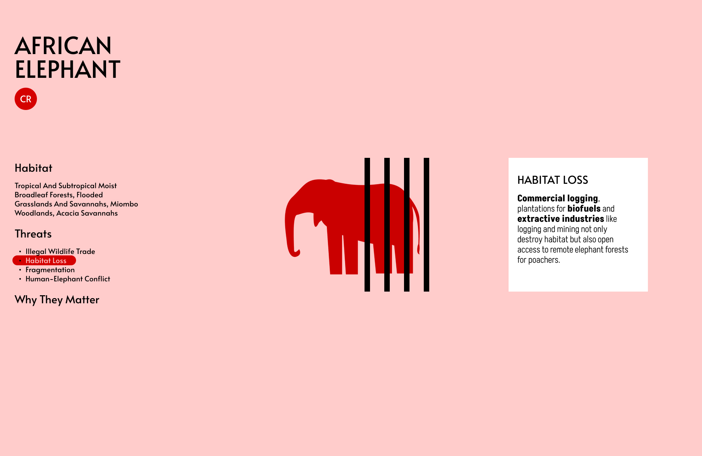

# 02B Design mockup and prototype

October 18, 2022

## Endangered Animal and Global Threats

WWF collaborates with UN to protecting endangered spaces and addressing global threats. The related Sustainable Development Goals are Goal 12: Sustainable Consumption and Production, Goal 13: Climate Action and Goal 14: Life Below Water. There are 93 species in total that WWF is currently saving them. 

World Wildlife Fund Species Directory (raw data): https://www.worldwildlife.org/species/directory

World Wildlife Fund Species Directory (cleaned data / spreadsheet): https://docs.google.com/spreadsheets/d/1bmsDEPcRj0aMrEHrE4UxG3wOUkZNEcnyO5EAdgCo0Yw/edit?usp=sharing
  
## Data Planning

The four variables are conservation status, species (by habitat), threats and why they matter information. 

Observations
<ul>
<li>All animal has at least one threat</li>
<li>Most of them have more than one threats</li>
<li>The threats are varies according to each habitats. For example, the top forest threats are illegal wildlife trade, habitat loss and elephant conflict, while the top ocean threats are climate change, by catch and gas development.</li>
</ul>

## Design Prototype

## Feedback

<ul>
<li>The scrolling telling is not nescessary for this data set. Because you have a cleaned data in hand, better use it wisely</li>
<li>Create a legend page with all data variables (conservation status, species, habitat, and threats)</li>
<li>Create a PNG or SVG of these variable and stack / layering them on top of each other in code</li>
<li>The final visualisation can be a page full of symbols</li>
<li>You can use the same elephant icon for all 7 endangered species because the variable will make each of them different from each other. For example,
<ul>
<li>African savanna elephant: Endangered, Habitat: Forests (savannas and open woodlands), Threats: 2 - ILLEGAL WILDLIFE TRADE and	HUMAN-ELEPHANT CONFLICT</li>
<li>Asian Elephant: Endangered, Habitat: Forests, Threats: 4, CAPTURE OF WILD ELEPHANTS,	HABITAT LOSS,	FRAGMENTATION,	HUMAN-ELEPHANT CONFLICT and	GENETIC THREAT FROM EXTIRPATION OF SMALL POPULATIONS</li>
</ul>
