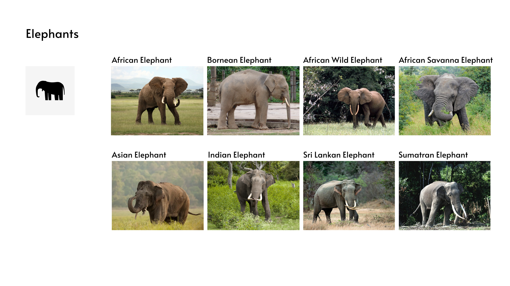

# 02D Final design, prototype and presentation

November 1, 2022

## Design

### Habitat SVG Design

I designed the habitat legend, using lines and rectangles. Therefore, they can be easily transformed into SVGs. They are all designed based on the natural environment of that area.

### Animal SVG Design

There are 48 animals in total in which each animal has a very unique apperance. However, having too many icons may cause a confusion. Therefore, I grouped each animals according to the species and that give me the result of 23 species. 

  

For example, African Elephant has bigger ears than the Bornean Elephant but both of them are elephant and therefore, they can share the elephant icon.

All animal

### Legend

## Coding

<ul>
  <li><a href="https://github.com/skyladfah/MajorStudio1_Qualitative/blob/main/week_3/index.html">index.html</a>
  <li><a href="https://github.com/skyladfah/MajorStudio1_Qualitative/blob/main/week_3/script.js">script.js</a>
  <li><a href="https://github.com/skyladfah/MajorStudio1_Qualitative/blob/main/week_3/styles.css">styles.css</a>
  <li><a href="https://github.com/skyladfah/MajorStudio1_Qualitative/blob/main/species_directory.csv">species_directory.csv (data set)</a>
<u/l>  
  

